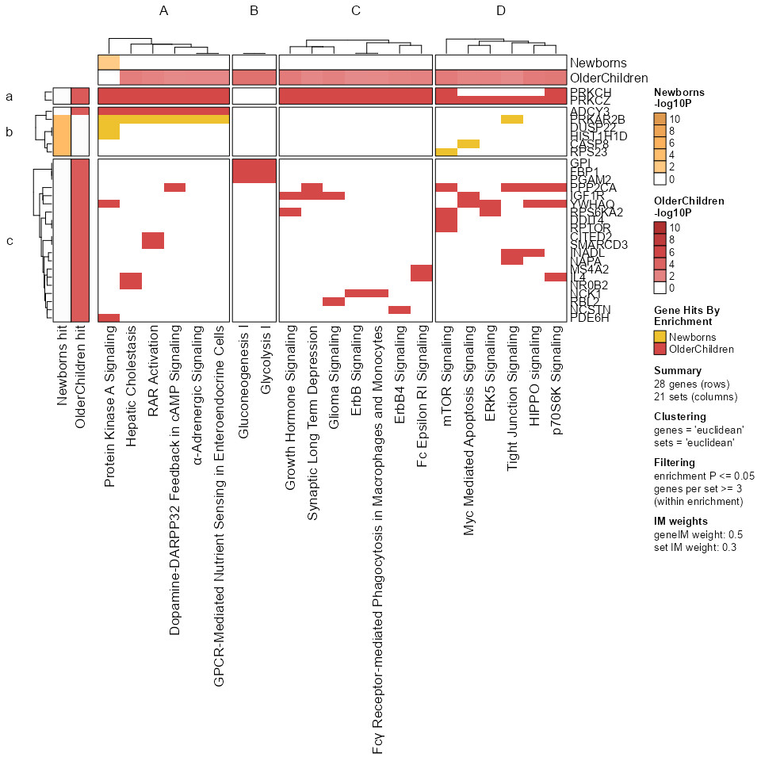
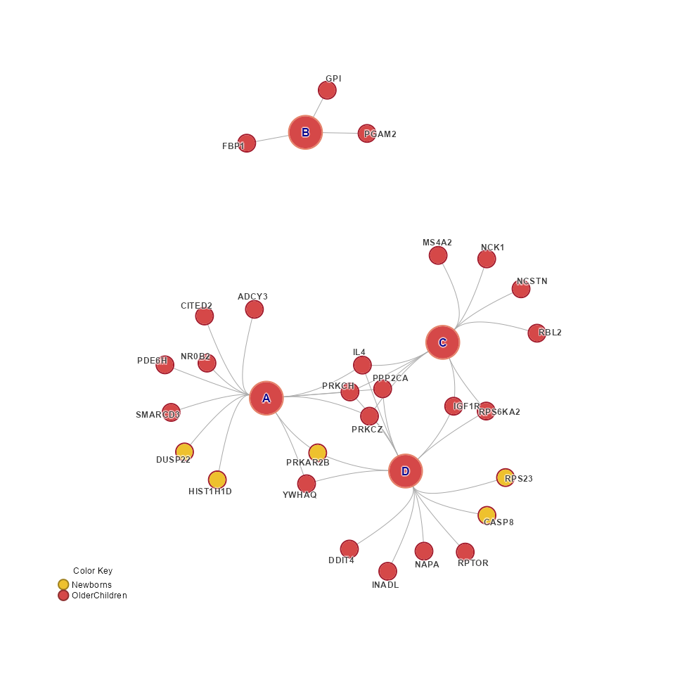
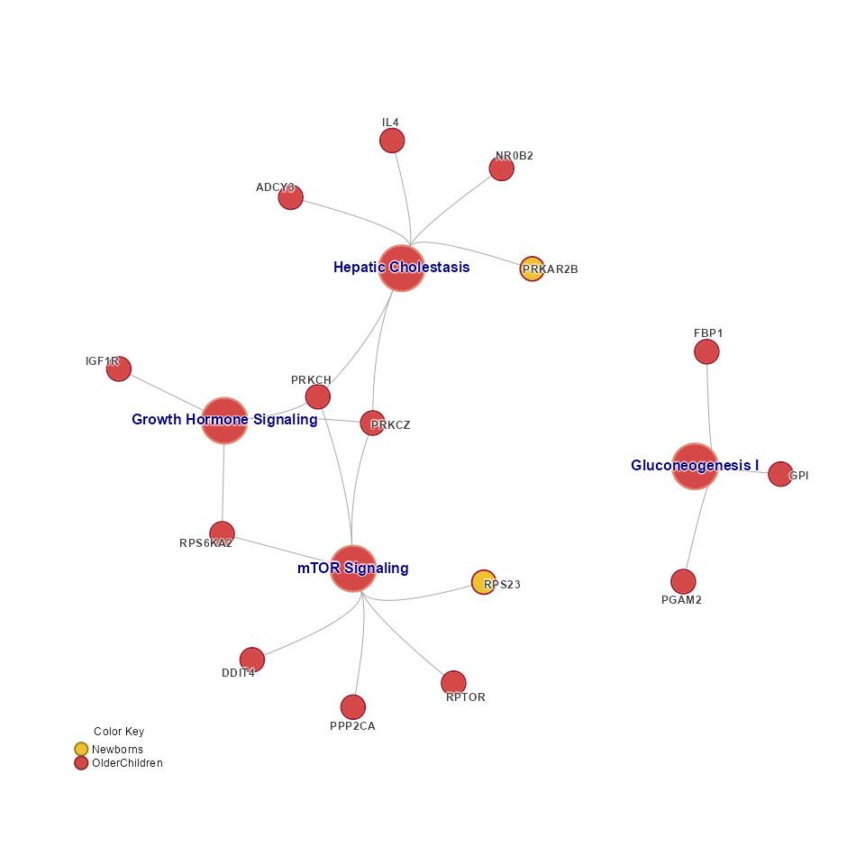
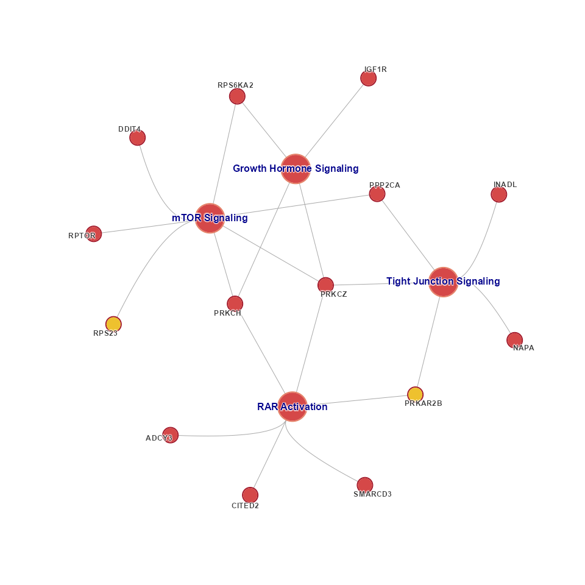
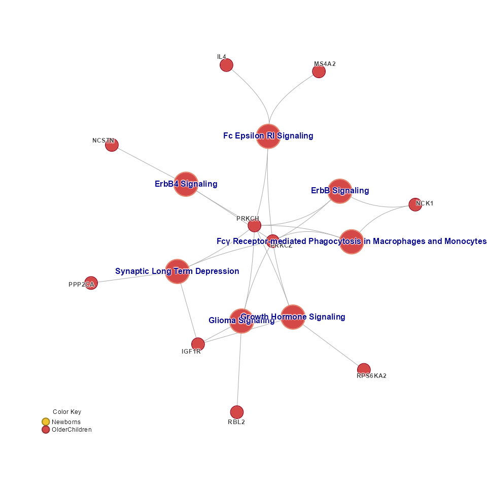

<!-- README.md is generated from README.Rmd. Please edit that file -->

# multienrichjam

The goal of multienrichjam is to enable Multi-Enrichment Analysis of
multiple gene set pathway enrichment datasets together.

This work was inspired by complementary tools based originally upon
“Enrichment Map”, a Cytoscape plugin developed by the lab of Dr. Gary
Bader.

- Bader lab
  [EnrichmentMap](https://www.baderlab.org/Software/EnrichmentMap) from
  [Merico,et al, PLoS One,
  2010](https://journals.plos.org/plosone/article?id=10.1371/journal.pone.0013984)

Similar methods were implemented in R by the group of Dr. Guangchuang
Yu, notably within the suite of `clusterProfiler` tools which include
`enrichplot::emapplot()` and `ggtangle::cnetplot()` among numerous other
powerful tools.

- [Biomedical Knowledge Mining using clusterProfiler
  (e-book)](https://yulab-smu.top/biomedical-knowledge-mining-book/index.html)
- [clusterProfiler](https://bioconductor.org/packages/release/bioc/html/clusterProfiler.html)
- [enrichplot](https://bioconductor.org/packages/release/bioc/html/enrichplot.html)

Multi-enrichment analysis is designed to complement existing tools,
while focusing on the details of comparing multiple enrichment results
together.

## How to install

Install using the `remotes` package:

    # if necessary, install 'remotes'
    # install.package("remotes")
    remotes::install_github("jmw86069/multienrichjam",
       upgrade="always",
       build_vignettes=TRUE,
       dependencies=TRUE);

Alternatively, use the `pak` package:

    # if necessary, install 'pak'
    # install.package("pak")
    pak::pkg_install("jmw86069/multienrichjam",
       upgrade=TRUE,
       dependencies=TRUE);

The argument `dependencies=TRUE` includes suggested packages, most
notably the ‘openxlsx’ package which is used to import Ingenuity Pathway
Analysis (IPA) results stored in Excel ‘xlsx’ format.

## Package Reference

Documentation is created using ‘pkgdown’ with all functions, articles,
and changelog.

[Full multienrichjam
documentation](https://jmw86069.github.io/multienrichjam)

# Quick walkthrough

Start with one or more enrichment results. Each enrichment result is
either a `data.frame` or `enrichResult` from clusterProfiler, and must
have the following columns:

- **Pathway name**: some identifier, name, or label
- **Enrichment P-value**: Typically adjusted P-value, or FDR
- **genes**: one field with genes involved in enrichment of each pathway

Any `enrichResult` will have this data already.

## `multiEnrichMap()` to create `Mem` output

``` r
Mem <- multiEnrichMap(list(
   Newborns=er_Newborns,
   OlderChildren=er_OlderChildren))
```

The output can be summarized by printing the object.

``` r
Mem
#> class: Mem
#> dim: 2 enrichments, 21 sets, 28 genes
#> - enrichments (2): Newborns, OlderChildren
#> - sets (21): mTOR Signaling, RAR Activation, ..., Gluconeogenesis I, Glycolysis I
#> - genes (28): ADCY3, CASP8, ..., SMARCD3, YWHAQ
#> Analysis parameters:
#> - top N per enrichment: 20
#> - significance threshold: 0.05 (colname: p.adjust)
#> - min gene count: 3
#> - direction colname:
```

## `prepare_folio()` to create `MemPlotFolio` output

This step determines pathway clusters, and defines other custom features
used to produce a “Mem Plot Folio” - which is a collection of data
visualization plots to navigate the results.

``` r
Mpf <- prepare_folio(Mem)
```

## `GenePathHeatmap()`

This step displays the underlying gene-versus-pathway data, and forms
the basis for most of the **multienrichjam** analysis.

``` r
GenePathHeatmap(Mpf)
```



Pathways are clustered according to gene content. This step is intended
to reduce redundancy, and to organize enrichment results based upon
shared subsets of genes.

Genes are also clustered according to shared pathways, which can provide
insights into the core genes involved across multiple pathways.

## `EnrichmentHeatmap()`

This step displays the enrichment P-values in -log10 scale, using the
same pathway clusters as defined in the gene-pathway heatmap.

``` r
EnrichmentHeatmap(Mpf)
```


## `CnetCollapsed()`

The “Cnet collapsed” network represents the Concept Network (Cnet) plot
using collapsed pathway clusters. The first step `prepare_folio()` is
critical to define or customize the pathway cluster assignment.

``` r
CnetCollapsed(Mpf)
```



By default, the cluster titles (“A”, “B”, “C”, “D”) are displayed,
however the pathways can be used to form a label.

``` r
CnetCollapsed(Mpf, type="set")
```


## `CnetExemplar()`

A “Cnet exemplar” plot uses one exemplar pathway per cluster, providing
an alternative network summary view.

``` r
CnetExemplar(Mpf)
```



A Cnet exemplar plot can also be created using user-defined pathways of
interest.

### Custom Cnet Exemplar

``` r
custom_sets <- c(
   "RAR Activation",
   "mTOR Signaling",
   "Growth Hormone Signaling",
   "Tight Junction Signaling")
cnet <- mem2cnet(Mem[, custom_sets, ], spread_labels=TRUE)

jam_igraph(cnet)
```



Note that this process is two-steps:

1.  Create the `cnet` network data.
2.  Plot using `jam_igraph()`.

## `CnetCluster()`

A “Cnet cluster” network displays the pathways only in one pathway
cluster. It is not used very often, and typically is helpful when there
might be different sub-networks within one cluster.

``` r
CnetCluster(Mpf, cluster="C")
```


